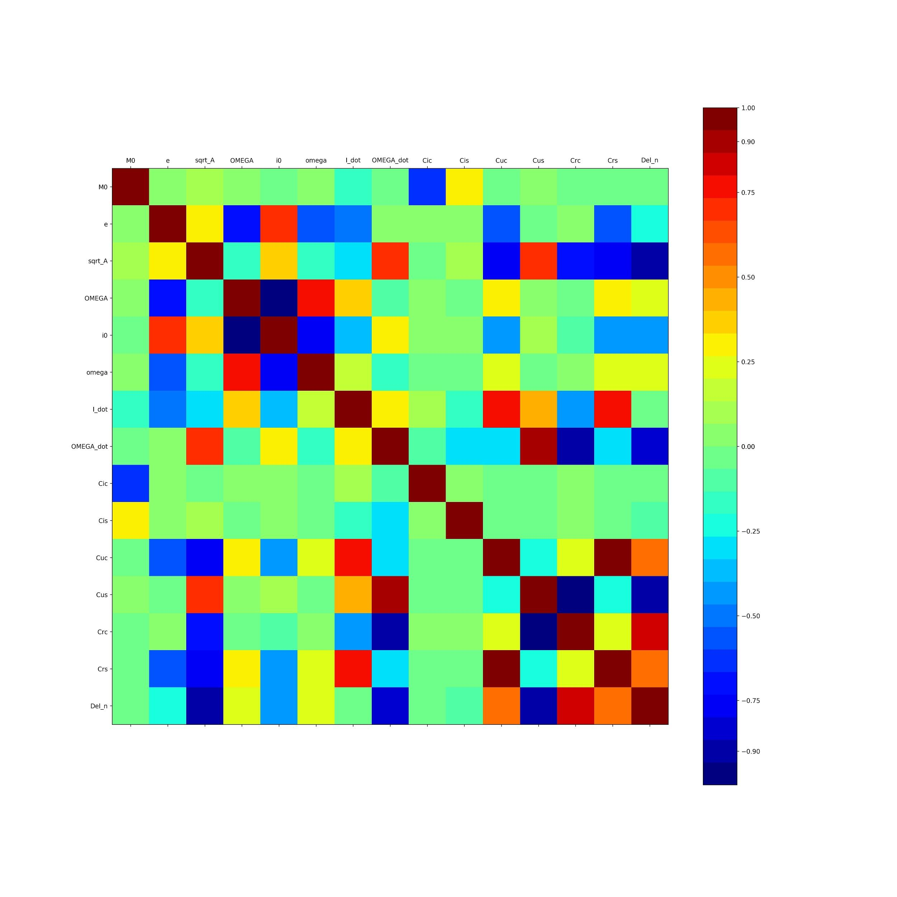

# Autonomous Ephemeris Predictions by navigation receivers - Smart India Hackathon Project

This Problem Statement was given by ISRO(Indian Space Research Organization) in Smart India Hackathon(India's Largest Hackathon) and our Team Won the 1st Prize in Smart India Hackathon.

# Problem Statement:

Satellite Navigation receivers require the satellite positions to determine their own positions. 
The satellite positions are derived from the ephemeris parameters that the navigation satellites transmit through the navigation signals. However, it requires a considerable amount of time to collect all the ephemeris information from the transmitted signal. This proposal aims at providing autonomous capacity to the receiver to estimate the ephemeris parameters of the satellites. 
This will reduce the TTFF(Time to First Fix). 
In this work, an intelligent prediction system is to be established that will utilize all the previous ephemeris data available to the receiver and estimate the current ephemeris of each of the satellites.

# Approach:

The Problem Statement is a Pure Time Series Problem
1) First we did the data analysis and did the following things:
   * Classify the rinex file(Input file given to us by ISRO) according to PRN
   * Plot graph for each parameter
   * Found that every parameter has a different trend
   * No outliers found from box plot
   * Plot covariance map plot
   * Found relation between different parameters.  

After Analysing the data we implemented the following algorithms: 

# Statistical Models:
* ARIMA
* Holt Winters
* Auto Arima
* Prophet

Limitations:
* Requires the data to be a stationary series.
* The given data set shows non stationary trends.
* Requires a lot of human intervention. 
* Redundancy in the models.

# Machine Learning Models:
* Linear Regression
* RandomForest
* XGBoost
* Lasso Regressor
* Ridge Regressor
* Hubber Regressor
* Lars
* SGD Regressor
* Support Vector Regressor (SVR)
* RANSCAC Algorithm

Limitations:
* Less accurate results for multi-step output

# Deep Learning Models:
* RNN
* LSTM (Encoder - Decoder)
* Multi - step, Multivariate LSTM (Encoder - Decoder)
* Multi Output LSTM

# Features:

  * The web-app accepts multiple files as input
  * Output as RINEX file
  * Multivariate LSTM
  * Data propagation
  * Modified algorithm for prediction
  * The algorithm is adaptive to any input size
  * Considered: Missing data, no data, data propagation
  
  * ## Covariance Plot
  
  
  
  * ## Multi-step, Multivariate LSTM (Encoder - Decoder)
  
  
  
  # Presentation
  
 * https://drive.google.com/open?id=1vwgjCqkhHNswF44rhz4PsxDuqzfGaJZ9
 
 * https://drive.google.com/open?id=1s8fn4B6I3xY_KayZn56nvwuKydeKKjbp
 
 ## Team Members:
   * ### Vindeep Chaudhari
   * ### Shreyas Chidrawar
   * ### Shraddha Varat
   * ### Mahesh Vetale
   * ### Rutuja Taware
   * ### Tanvi Bhargaw
 
 
